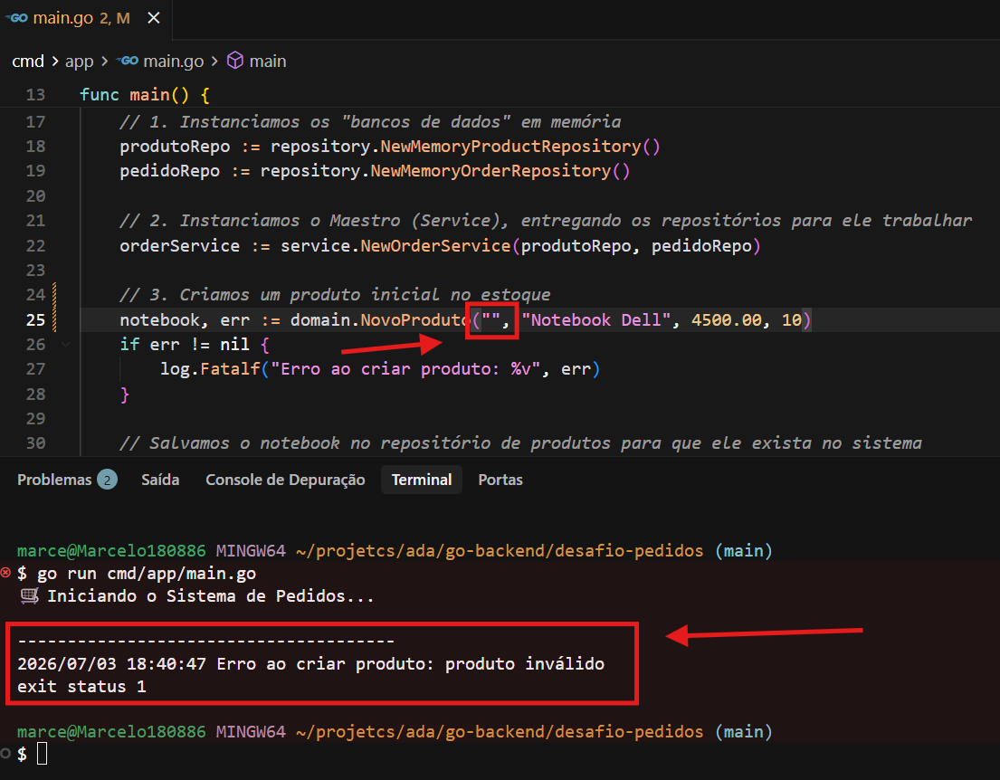
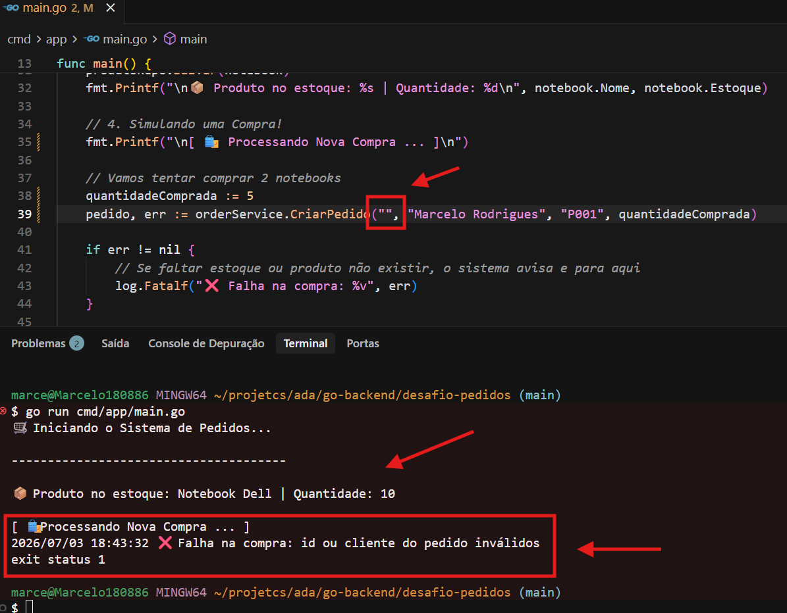
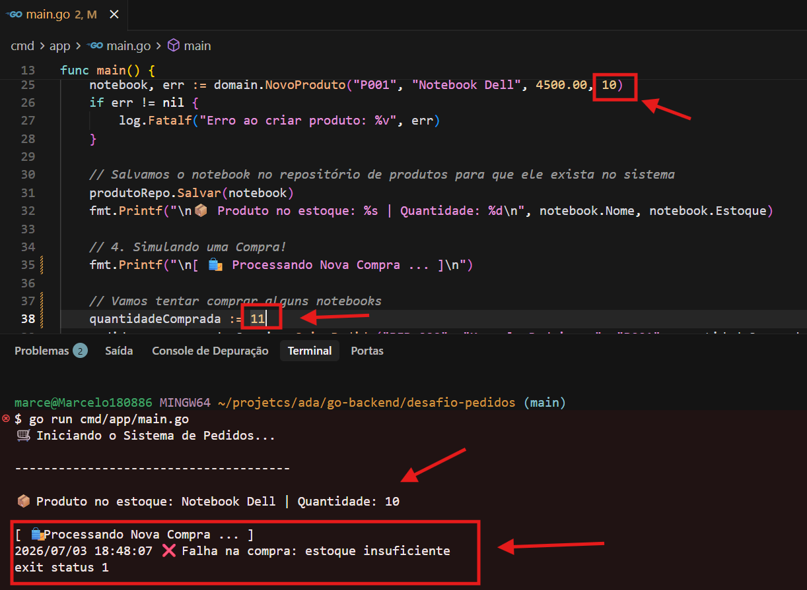
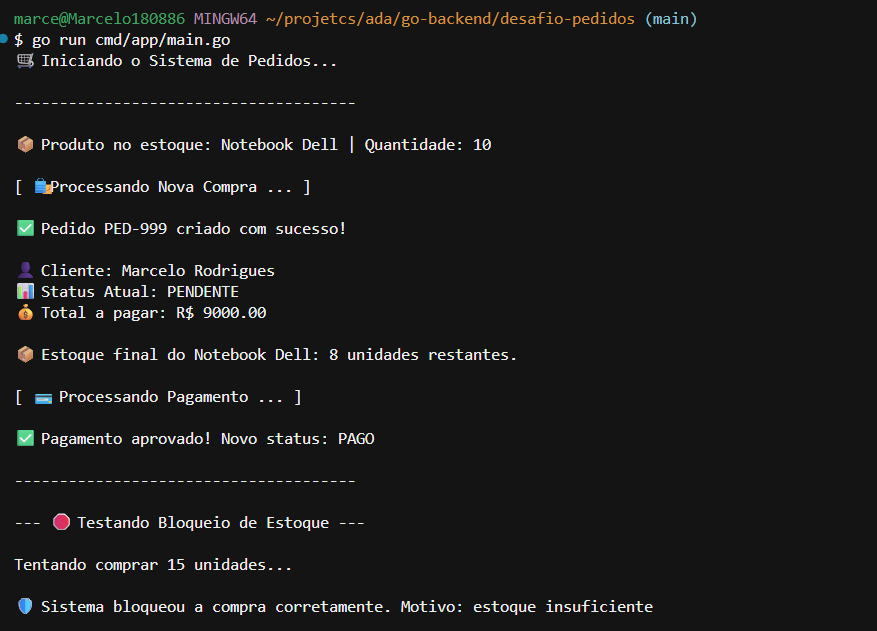
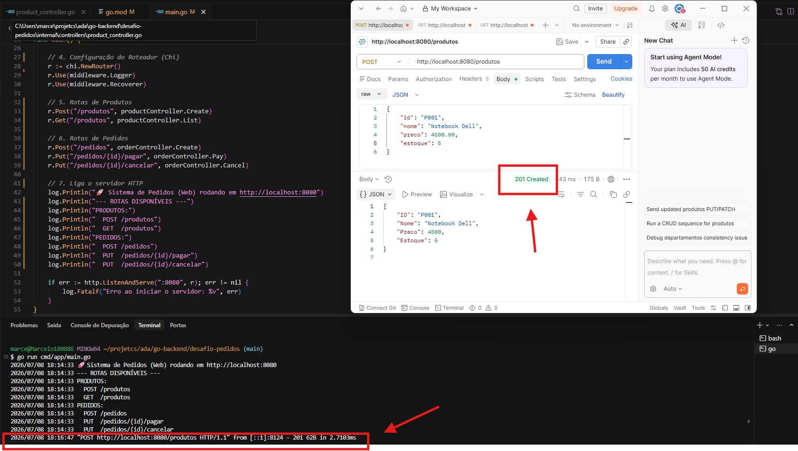
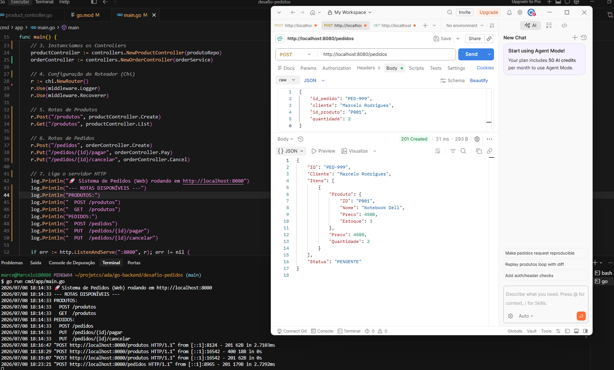
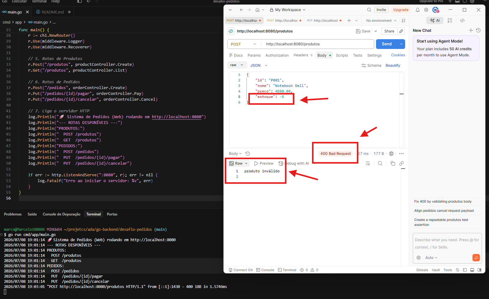
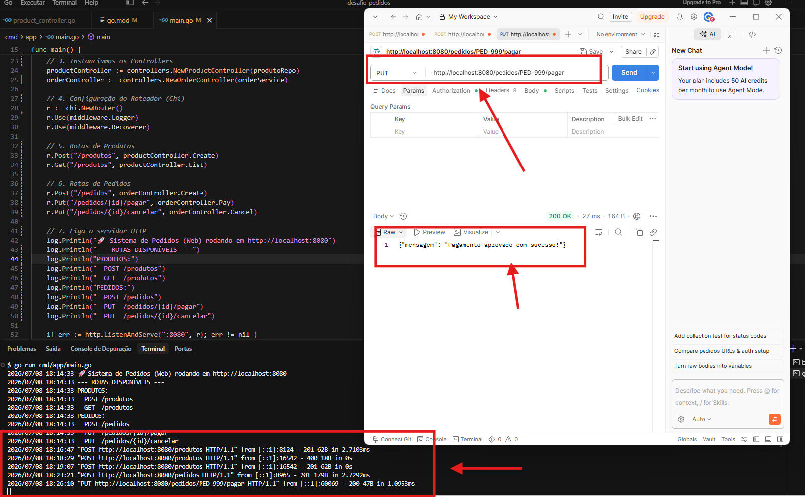
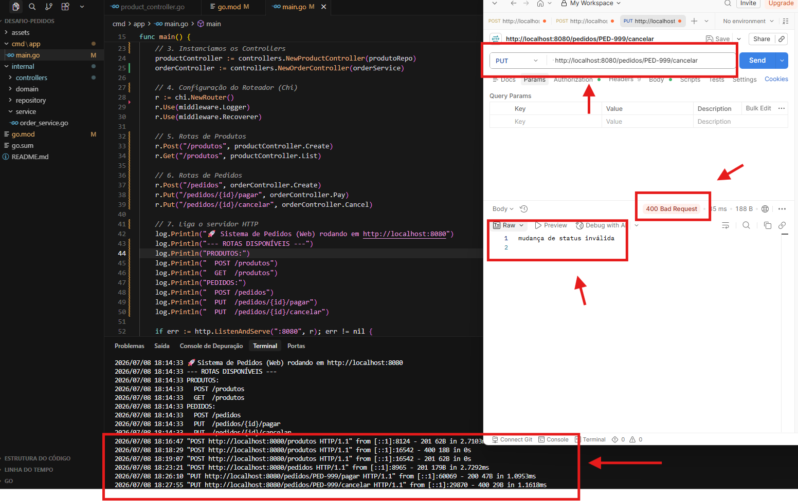

# 📦 Sistema de Processamento de Pedidos (Web API - Go)

Este repositório contém a resolução do desafio prático de arquitetura e domínio em Go, desenvolvido durante a formação **Ser+Tech (Ada Tech & Núclea Associação)**.

O projeto evoluiu de uma simulação no terminal para uma **API Web 100% funcional**, operando com banco de dados relacional (**PostgreSQL**), roteamento HTTP, geração automática de queries com **sqlc** e gerenciamento de pool de conexões com **pgx**.

## 🎯 Objetivo do Projeto
Construir o núcleo de um serviço de pedidos isolando as regras de negócio puras de frameworks externos. A aplicação simula um ambiente de **e-commerce**, protegendo a integridade do banco de dados e garantindo regras como: não vender sem estoque, validar a existência de clientes e impedir mudanças de status inválidas (ex: **cancelar um pedido já pago**).

## 🏗️ Arquitetura e Estrutura
O projeto foi estruturado seguindo padrões modernos do ecossistema Go, substituindo repositórios em memória por persistência real e tipagem estrita:

* `cmd/app/` : Ponto de entrada da aplicação, configuração de dependências e orquestrador do servidor HTTP (**go-chi**).
* `internal/controllers/` : Camada Web. Traduz as requisições JSON da internet para UUIDs e tipos nativos do sistema.
* `internal/repository/db/` : Camada de dados com código gerado automaticamente pelo **sqlc**, garantindo acesso seguro e tipado ao PostgreSQL.
* `internal/service/` : Orquestrador dos casos de uso (**Criar Pedido, Pagar, Cancelar**), coordenando a validação de regras antes de acionar o banco.
* `migrations/` & `sqlc/` : Arquivos de infraestrutura para criação das tabelas e estruturação das consultas SQL.

```text
pedidos/
├── cmd/app/
│   └── main.go                  # Ponto de entrada, injeção de dependências e roteador
├── internal/
│   ├── controllers/             # Handlers HTTP
│   │   ├── client_controller.go
│   │   ├── order_controller.go
│   │   └── product_controller.go
│   ├── repository/db/           # Código de persistência gerado via sqlc + pgx
│   └── service/
│       └── order_service.go     # Casos de uso e regras de negócio
├── migrations/                  # Arquivos de versionamento do banco (.sql)
├── sqlc/queries/                # Consultas SQL para geração de código
├── .env                         # Variáveis de ambiente e secrets
├── Makefile                     # Automação de comandos
└── sqlc.yaml                    # Configuração de mapeamento e overrides de tipos (UUID, Decimal)
```

Padrões: Clean Architecture, Dependency Injection, Interface Segregation.
Orquestrador dos casos de uso (Criar Pedido, Pagar, Cancelar), coordenando a comunicação entre o Domínio e a camada de Dados.

## 🚀 Como Executar

Clone este repositório em sua máquina:
```bash
git clone https://github.com/MarceloRodrigues1853/ada_go-desafio_pedidos.git
```
---
### Navegue até a pasta do projeto:
```bash
cd ada_go-desafio_pedidos
```
### 1. Suba a infraestrutura (Banco de Dados):
Certifique-se de ter o Docker instalado e o arquivo .env configurado.
```bash
docker-compose up -d
```

### 2. Crie as tabelas (Migrations) e baixe as dependências:
```bash
go mod tidy
make migrate-up
```

### 3. Execute a API:
```bash
make run
```

### A API ficará rodando no endereço `http://localhost:8080`
---

## 🧪 Rotas Disponíveis (Postman)
### 1. Clientes
**POST** /clientes -> Cadastra um novo cliente no banco (Retorna UUID).

**GET** /clientes -> Lista os clientes cadastrados.

### 2. Produtos (Estoque)
**POST** /produtos -> Cadastra um novo produto.

**GET** /produtos -> Lista catálogo e saldo em estoque.

### 3. Pedidos (Vendas)
**POST** /pedidos -> Cria carrinho, valida cliente via UUID, associa produtos via Foreign Key e desconta estoque.

**PUT** /pedidos/{id}/pagar -> Aprova pagamento e altera status para PAID.

**PUT** /pedidos/{id}/cancelar -> Cancela venda (apenas se estiver pendente) e altera status para CANCELED.

---

## 🧪 Exemplos de Uso e Testes no Terminal(Cenários)
A aplicação inclui um script de simulação no `main.go` que atua como um **teste de integração** das regras de negócio. Abaixo estão as evidências de execução cobrindo os cenários de **sucesso** e **bloqueio**:

### Bloqueio de Produto Inválido
O sistema impede a inicialização se tentar registrar um produto com dados ausentes (como nome vazio) ou valores negativos.



### Validação de Cliente e Pedido
O sistema barra a criação de carrinhos de compra caso a identificação do pedido ou do cliente estejam em branco.



## Proteção contra Estoque Insuficiente
Se a quantidade solicitada for maior que o saldo do repositório, a entidade do domínio entra em ação e estorna a operação.



### Caminho Feliz (Compra e Pagamento)
O fluxo ideal, onde o sistema aprova a compra, reduz o estoque no repositório em memória e atualiza o status via Service.



---

## 🧪 Rotas e Testes (Postman)

Com o servidor rodando, você pode utilizar o Postman, Thunder Client ou `curl` para interagir com a API.

### 1. Produtos (Estoque)
* **POST** `/produtos` -> Cadastra produto no sistema.
* **GET** `/produtos` -> Lista catálogo e estoque.

### 2. Pedidos (Vendas)
* **POST** `/pedidos` -> Cria carrinho e desconta estoque automaticamente.
* **PUT** `/pedidos/{id}/pagar` -> Aprova pagamento.
* **PUT** `/pedidos/{id}/cancelar` -> Cancela venda e estorna estoque.

---

## Casos de Teste (Postman)

Abaixo estão os resultados das requisições reais feitas à API, comprovando o funcionamento do roteamento e a blindagem das regras de negócio pela Clean Architecture.

**1. Rota de Criação com Sucesso (201 Created)** O sistema aceita o payload e cadastra o produto ou pedido perfeitamente em memória.




**2. Bloqueio de Domínio - Validação de Dados (400 Bad Request)** Tentativa de cadastrar um produto com estoque negativo (-5). A entidade de Domínio intercepta e bloqueia a ação antes de chegar ao repositório.


**3. Orquestração de Pagamento (200 OK)** O Service localiza o pedido, o Domínio aprova a mudança de status e o Repositório salva o novo estado.


**4. Proteção contra Status Inválido (400 Bad Request)** Tentativa de cancelar um pedido que **já foi pago**. A regra de negócio proíbe a ação e devolve o erro customizado (`mudança de status inválida`).


---

## 🛠️ Tecnologias Utilizadas
- **Linguagem**: Go (Golang) 1.22+

- **Banco de Dados**: PostgreSQL rodando em Docker

- **Drivers e Conexão**: `pgxpool` (jackc/pgx/v5)

- **Roteamento HTTP**: `go-chi/chi`

- **Geração de DB Code**: `sqlc`

- **Migrations**: `golang-migrate`

- **Tipagem**: UUIDs oficiais do Google (`google/uuid`)

---
*Desenvolvido como parte do módulo de backend em Go da Ada Tech.*
