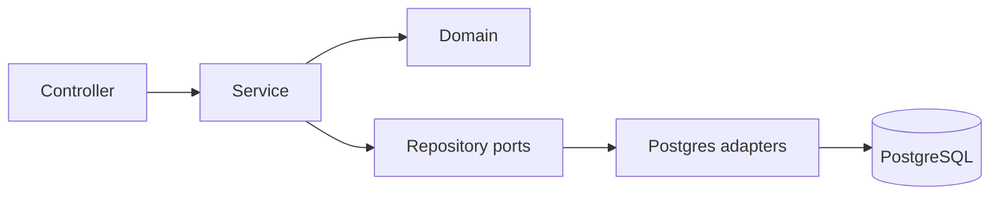

# Sistema de Pedidos — Go, DDD e Clean Architecture

API monolítica de pedidos para estudo de Domain-Driven Design (DDD), Clean Architecture e consistência transacional com PostgreSQL.

## Fase 1 concluída

O fluxo principal da aplicação é:

```text
Controller → Service → Domain
                  ↓
              Repository → PostgreSQL
```

- Controllers cuidam de HTTP, JSON, parâmetros e status HTTP.
- Services orquestram os casos de uso e não conhecem sqlc/pgx.
- Domain concentra invariantes de cliente, produto, item e pedido.
- Repositories traduzem domínio para PostgreSQL; somente eles usam `pgx` e `sqlc`.

## Regras de negócio protegidas

- Pedido novo precisa ter pelo menos um item e inicia como `PENDING`.
- Itens exigem quantidade e preço positivos.
- O preço do item vem do catálogo persistido; o payload não define o preço da venda.
- Estoque é reservado em uma transação e nunca pode ficar negativo.
- Apenas pedidos `PENDING` podem ser pagos ou cancelados.
- Cancelamento devolve estoque e altera status na mesma transação.
- Respostas de cliente não expõem `password_hash`.

## Estrutura

```text
cmd/app/                       composition root, HTTP e DI
internal/
  controllers/                 adaptadores HTTP
  domain/                      entidades, agregado e invariantes
    order/                     Order e OrderItem
  service/                     casos de uso e logging decorator
  repository/
    repository.go              portas e adaptadores PostgreSQL
    db/                        código gerado pelo sqlc (não editar manualmente)
migrations/                    schema e constraints de integridade
sqlc/queries/                  fonte das queries SQL
```

## Arquitetura


```mermaid
flowchart LR
    C["Controller"] --> S["Service"]
    S --> D["Domain"]
    S --> R["Repository ports"]
    R --> P["Postgres adapters"]
    P --> DB[(PostgreSQL)]
```

## Tecnologias

- Go 1.26+
- PostgreSQL
- pgx/v5 e pgxpool
- sqlc
- Chi
- golang-migrate
- bcrypt

## Executar localmente

Pré-requisitos: Go, Docker, `migrate` e `sqlc` instalados.

```bash
docker-compose up -d
make migrate-up
make run
```

Configure `.env` com `DB_URL` e, opcionalmente, `PORT`. A API inicia em `http://localhost:8080` por padrão.

## Endpoints

| Método | Rota | Descrição |
|---|---|---|
| POST | `/clientes` | Cria cliente |
| GET | `/clientes` | Lista clientes sem hash de senha |
| GET | `/clientes/{id}` | Busca cliente |
| POST | `/produtos` | Cria produto válido |
| GET | `/produtos` | Lista produtos |
| GET | `/produtos/{id}` | Busca produto |
| POST | `/pedidos` | Cria pedido e reserva estoque |
| GET | `/pedidos?limit=10&offset=0` | Lista pedidos paginados |
| GET | `/pedidos/{id}` | Busca pedido |
| POST | `/pedidos/{id}/pagar` | Paga pedido pendente |
| POST | `/pedidos/{id}/cancelar` | Cancela pedido pendente e estorna estoque |

### Exemplo: criar pedido

```json
{
  "cliente_id": "uuid-do-cliente",
  "itens": [
    { "produto_id": "SKU-001", "quantidade": 2 }
  ]
}
```

`preco_unitario`, se presente em clientes antigos, é ignorado. O service usa o preço atual do produto no catálogo ao criar o item.

## Status HTTP

- `201 Created`: cliente, produto ou pedido criado.
- `200 OK`: consulta, pagamento ou cancelamento concluído.
- `400 Bad Request`: JSON, UUID ou invariantes de entrada inválidos.
- `404 Not Found`: cliente, produto ou pedido inexistente.
- `409 Conflict`: e-mail/produto duplicado, estoque insuficiente ou pedido fora de `PENDING`.
- `500 Internal Server Error`: falha de infraestrutura.

## Testes

```bash
go test ./...
```

A suíte combina testes de domínio, controllers e integração com PostgreSQL. Os testes de integração usam `DB_URL` e criam dados de teste com IDs/e-mails únicos.

## Banco e migrations

Após aplicar a Fase 1, execute a migration `000004_add_domain_constraints.up.sql`. Ela adiciona constraints para preço positivo, estoque não negativo, quantidade positiva e status permitido.

Não edite `internal/repository/db/*.go` manualmente: esses arquivos são gerados por `sqlc` a partir de `sqlc/queries`.

## Documentação de estudo

O vault Obsidian `DDD-Pedidos` contém a visão arquitetural da Fase 1, os casos de uso e os cards de revisão.
