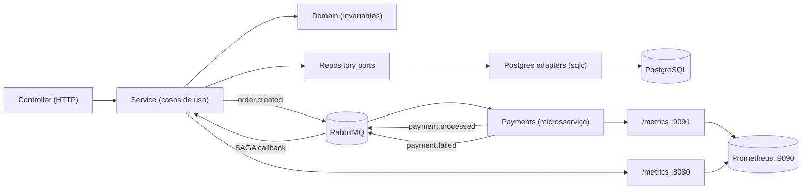

# Sistema de Pedidos — Go, DDD e Clean Architecture

Sistema de pedidos para estudo de Domain-Driven Design (DDD), Clean Architecture, microsserviços, mensageria (SAGA) e observabilidade, com consistência transacional em PostgreSQL.

## Fases implementadas

| Fase | Descrição | Status |
|---|---|---|
| 1 | API monolítica com DDD, Clean Architecture e PostgreSQL | ✅ Concluída |
| 2 | Microsserviço de pagamentos isolado (`cmd/payments`) | ✅ Concluída |
| 3 | Mensageria assíncrona com RabbitMQ + Dead Letter Queue (DLQ) | ✅ Concluída |
| 4 | Orquestração SAGA com compensação (`payment.failed` → cancelar + estornar) | ✅ Concluída |
| 5 | Observabilidade: logs estruturados (`slog`) e métricas Prometheus | ✅ Concluída |
| 6 | Documentação (README, DIAGNOSTICO.md e assets) | ✅ Concluída |

## Arquitetura


```mermaid
flowchart LR
    C["Controller (HTTP)"] --> S["Service (casos de uso)"]
    S --> D["Domain (invariantes)"]
    S --> R["Repository ports"]
    R --> P["Postgres adapters (sqlc)"]
    P --> DB[(PostgreSQL)]

    S -->|"order.created"| RB[(RabbitMQ)]
    RB --> PM["Payments (microsserviço)"]
    PM -->|"payment.processed"| RB
    PM -->|"payment.failed"| RB
    RB -->|"SAGA callback"| S
    PM --> MET["/metrics :9091"]
    S --> MET2["/metrics :8080"]
    MET --> PR[(Prometheus :9090)]
    MET2 --> PR
```

### Fluxo da SAGA

1. `POST /pedidos` cria o pedido, reserva o estoque e publica `order.created` no RabbitMQ.
2. O microsserviço de pagamentos consome `order.created`, processa a cobrança (idempotente) e publica o resultado.
3. `payment.processed` → o serviço de pedidos marca o pedido como `PAID` e encerra a SAGA.
4. `payment.failed` → **compensação**: o pedido é cancelado e o estoque é estornado na mesma transação.
5. Mensagens rejeitadas (Nack) são encaminhadas para a **Dead Letter Queue (DLQ)**.

## Estrutura

```text
cmd/app/                       composition root da API (HTTP e DI)
cmd/payments/                  composition root do microsserviço de pagamentos
internal/
  controllers/                 adaptadores HTTP
  domain/                      entidades, agregado e invariantes
    order/                     Order e OrderItem
  service/                     casos de uso, logging decorator e callbacks da SAGA
  payments/                    serviço e handler de pagamentos (idempotência)
  repository/
    repository.go              portas e adaptadores PostgreSQL
    db/                        código gerado pelo sqlc (não editar manualmente)
  events/                      contratos dos eventos da SAGA (topics)
  infra/
    broker/                    RabbitMQ (publisher, consumer e DLQ)
    metrics/                   coletores Prometheus
    logger/                    handler de logs com propagação de saga_id
migrations/                    schema e constraints de integridade
sqlc/queries/                  fonte das queries SQL
```

## Regras de negócio protegidas

- Pedido novo precisa ter pelo menos um item e inicia como `PENDING`.
- Itens exigem quantidade e preço positivos.
- O preço do item vem do catálogo persistido; o payload não define o preço da venda.
- Estoque é reservado em uma transação e nunca pode ficar negativo.
- Apenas pedidos `PENDING` podem ser pagos ou cancelados.
- Cancelamento devolve estoque e altera status na mesma transação.
- Pagamentos são **idempotentes** (um pedido nunca é pago duas vezes).
- Respostas de cliente não expõem `password_hash`.

## Tecnologias

- Go 1.26+
- PostgreSQL (pgx/v5 e pgxpool)
- sqlc e golang-migrate
- Chi
- RabbitMQ (amqp091-go) + Dead Letter Queue
- Prometheus (client_golang)
- bcrypt
- Docker e docker-compose

## Executar localmente

Pré-requisitos: Go, Docker, `migrate` e `sqlc` instalados.

### Opção A — Tudo via Docker (recomendado)

Sobe PostgreSQL, RabbitMQ, API, payments e Prometheus:

```bash
docker-compose up -d
docker-compose exec app sh   # (opcional) executar migrations dentro do container
```

### Opção B — Local com infraestrutura em Docker

```bash
docker-compose up -d postgres rabbitmq
make migrate-up
make run        # API em http://localhost:8080
go run cmd/payments/main.go   # microsserviço de pagamentos
```

Configure `.env` com `DB_URL` e, opcionalmente, `PORT`, `RABBITMQ_URL` e `METRICS_PORT`.

## Endpoints

### API de pedidos (`:8080`)

| Método | Rota | Descrição |
|---|---|---|
| POST | `/clientes` | Cria cliente |
| GET | `/clientes` | Lista clientes sem hash de senha |
| GET | `/clientes/{id}` | Busca cliente |
| POST | `/produtos` | Cria produto válido |
| GET | `/produtos` | Lista produtos |
| GET | `/produtos/{id}` | Busca produto |
| POST | `/pedidos` | Cria pedido, reserva estoque e dispara a SAGA |
| GET | `/pedidos?limit=10&offset=0` | Lista pedidos paginados |
| GET | `/pedidos/{id}` | Busca pedido |
| POST | `/pedidos/{id}/pagar` | Paga pedido pendente |
| POST | `/pedidos/{id}/cancelar` | Cancela pedido pendente e estorna estoque |
| GET | `/metrics` | Métricas Prometheus da API |

### Microsserviço de pagamentos (`:9091`)

| Método | Rota | Descrição |
|---|---|---|
| GET | `/metrics` | Métricas Prometheus (pagamentos processados, mensagens na DLQ) |

### Painéis

- RabbitMQ Management: http://localhost:15672 (`guest`/`guest`)
- Prometheus: http://localhost:9090

### Exemplo: criar pedido

```json
{
  "cliente_id": "uuid-do-cliente",
  "itens": [
    { "produto_id": "SKU-001", "quantidade": 2 }
  ]
}
```

`preco_unitario`, se presente, é ignorado. O service usa o preço atual do produto no catálogo ao criar o item.

## Métricas expostas

| Métrica | Tipo | Descrição |
|---|---|---|
| `orders_created_total` | Counter | Total de pedidos criados |
| `payments_processed_total{status}` | CounterVec | Pagamentos processados por status (`PAID`/`FAILED`) |
| `messages_dlq_total` | Counter | Mensagens rejeitadas enviadas à DLQ |
| `order_processing_duration_seconds` | Histogram | Latência do processamento de pedidos |

## Status HTTP

- `201 Created`: cliente, produto ou pedido criado.
- `200 OK`: consulta, pagamento ou cancelamento concluído.
- `400 Bad Request`: JSON, UUID ou invariantes de entrada inválidos.
- `404 Not Found`: cliente, produto ou pedido inexistente.
- `409 Conflict`: e-mail/produto duplicado, estoque insuficiente ou pedido fora de `PENDING`.
- `500 Internal Server Error`: falha de infraestrutura.

## Testes

```bash
go test ./...
go vet ./...
```

A suíte combina testes de domínio, controllers, SAGA, DLQ e integração com PostgreSQL. Os testes de integração usam `DB_URL` e criam dados de teste com IDs/e-mails únicos.

## Banco e migrations

Execute as migrations de `migrations/` (incluindo `000004_add_domain_constraints.up.sql`, que adiciona constraints de preço positivo, estoque não negativo, quantidade positiva e status permitido).

Não edite `internal/repository/db/*.go` manualmente: esses arquivos são gerados por `sqlc` a partir de `sqlc/queries`.

## Documentação de estudo

O vault Obsidian `DDD-Pedidos` contém a visão arquitetural, os casos de uso e os cards de revisão. O relatório `DIAGNOSTICO.md` traz a auditoria arquitetural e o próximo passo recomendado (teste E2E com testcontainers-go).