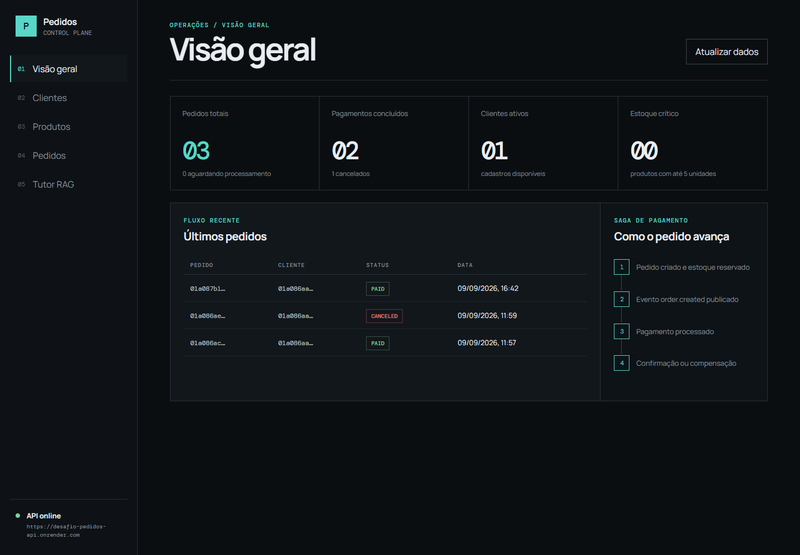
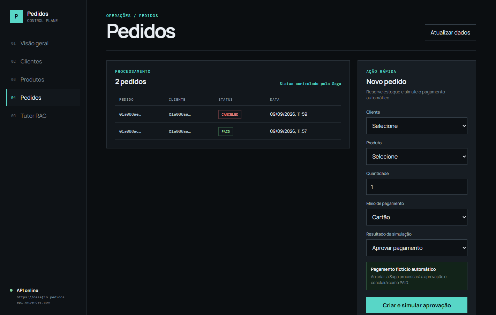
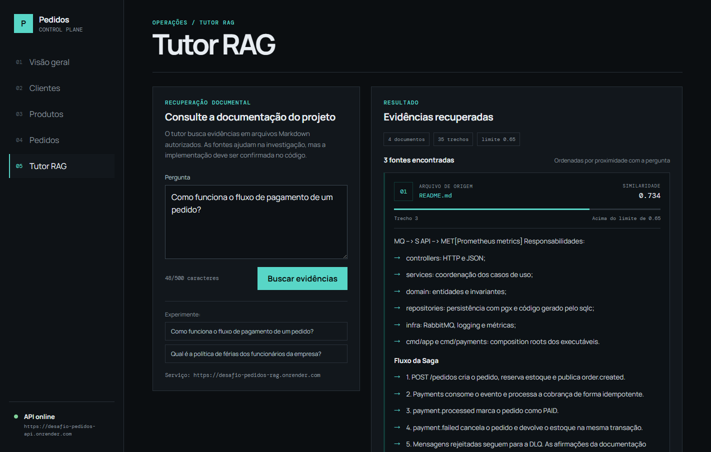
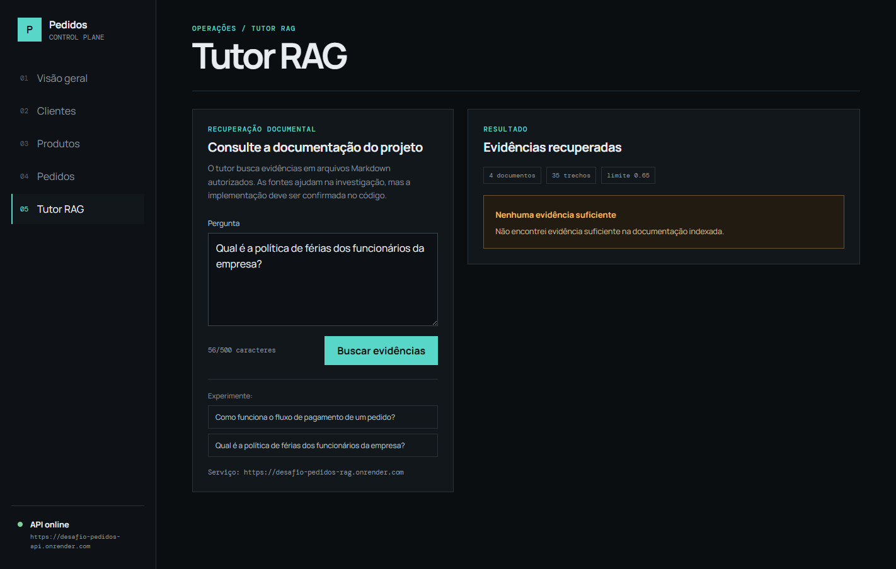
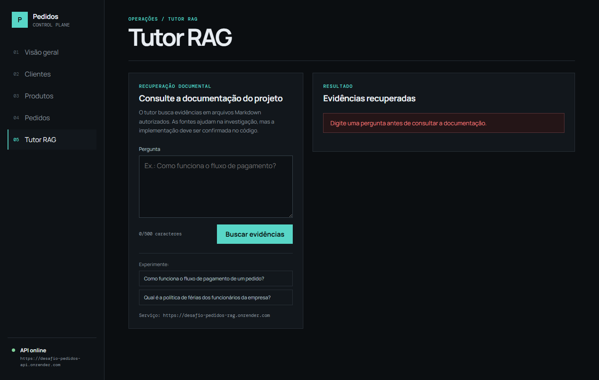
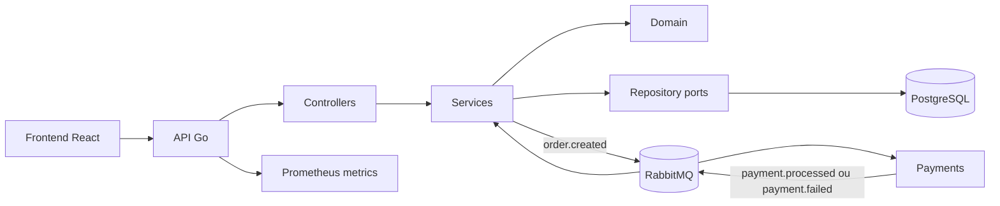
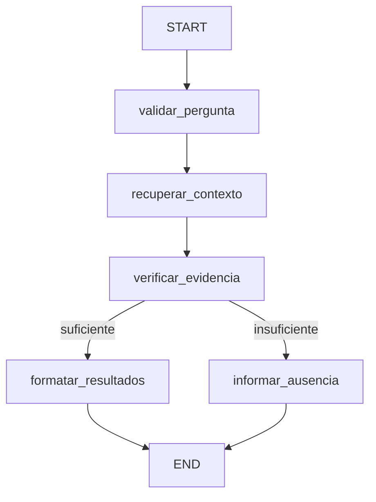

# Sistema de Pedidos

[](https://github.com/MarceloRodrigues1853/ada_go-desafio_pedidos/actions/workflows/ci.yml)

Backend de pedidos desenvolvido em Go para demonstrar DDD, Clean Architecture,
PostgreSQL, mensageria assíncrona, Saga, observabilidade e um agente tutor com
RAG e LangGraph.

## Demonstração online

- Painel: <https://frontend-phi-ten-75.vercel.app>
- Saúde da API: <https://desafio-pedidos-api.onrender.com/health>

O ambiente usa planos gratuitos. API e Payments podem levar cerca de um minuto
para despertar após um período sem acesso. Antes de criar um pedido na
demonstração, abra também
<https://desafio-pedidos-payments.onrender.com/health> e aguarde `{"status":"ok"}`.

## Interface

### Visão geral operacional

O painel reúne os indicadores de pedidos, pagamentos, clientes e estoque, além
dos pedidos mais recentes e das etapas da Saga.



<details>
<summary>Ver criação e acompanhamento de pedidos</summary>

### Fluxo de pedidos

A interface permite selecionar cliente, produto, quantidade, meio de pagamento
e o resultado da simulação. O status final é controlado pela Saga assíncrona.



</details>

<details>
<summary>Ver Tutor RAG com evidências</summary>

### Recuperação documental

Uma pergunta relacionada ao projeto retorna até três trechos ordenados por
similaridade, preservando arquivo de origem, posição e conteúdo recuperado.



</details>

<details>
<summary>Ver comportamento sem evidência suficiente</summary>

### Recusa de resposta sem suporte documental

Quando nenhum trecho atinge o limite mínimo, o tutor admite que não encontrou
evidência suficiente em vez de apresentar uma resposta sem respaldo.



</details>

<details>
<summary>Ver validação de pergunta vazia</summary>

### Entrada obrigatória

Uma consulta vazia é interrompida no frontend com uma mensagem clara, sem
acionar desnecessariamente a API de embeddings.



</details>

## Funcionalidades

- cadastro e consulta de clientes e produtos;
- criação de pedidos com reserva transacional de estoque;
- pagamento idempotente;
- cancelamento com devolução de estoque;
- Saga assíncrona por RabbitMQ;
- compensação quando o pagamento falha;
- Dead Letter Queue para mensagens rejeitadas;
- logs estruturados com `saga_id`;
- métricas Prometheus;
- RAG local sobre a documentação com embeddings Gemini;
- orquestração explícita do RAG com LangGraph.

## Arquitetura


```mermaid
flowchart LR
    UI[Frontend React] --> API[API Go]
    API --> C[Controllers]
    C --> S[Services]
    S --> D[Domain]
    S --> R[Repository ports]
    R --> PG[(PostgreSQL)]
    S -->|order.created| MQ[(RabbitMQ)]
    MQ --> PAY[Payments]
    PAY -->|payment.processed ou payment.failed| MQ
    MQ --> S
    API --> MET[Prometheus metrics]
```

Responsabilidades:

- `controllers`: HTTP e JSON;
- `services`: coordenação dos casos de uso;
- `domain`: entidades e invariantes;
- `repositories`: persistência com pgx e código gerado pelo sqlc;
- `infra`: RabbitMQ, logging e métricas;
- `cmd/app` e `cmd/payments`: composition roots dos executáveis.

## Fluxo da Saga

1. `POST /pedidos` cria o pedido, reserva estoque e publica `order.created`.
2. Payments consome o evento e processa a cobrança de forma idempotente.
3. `payment.processed` marca o pedido como `PAID`.
4. `payment.failed` cancela o pedido e devolve o estoque na mesma transação.
5. Mensagens rejeitadas seguem para a DLQ.

As afirmações da documentação devem ser confirmadas no código. O
`DIAGNOSTICO.md` pode representar um momento anterior do projeto.

## Regras de negócio

- pedido novo exige pelo menos um item e começa como `PENDING`;
- quantidade e preço precisam ser positivos;
- o preço utilizado vem do catálogo persistido;
- estoque é reservado transacionalmente e não pode ficar negativo;
- somente pedidos pendentes podem ser pagos ou cancelados;
- cancelamento devolve estoque;
- pagamentos são idempotentes;
- respostas de clientes não expõem `password_hash`.

## Tecnologias

- Go 1.26, Chi, pgx/v5 e sqlc;
- PostgreSQL e golang-migrate;
- RabbitMQ e Dead Letter Queue;
- Prometheus e `slog`;
- Python, Gemini Embeddings e LangGraph;
- React, TypeScript e Vite;
- Docker Compose e GitHub Actions.

## Configuração local

Copie o exemplo e mantenha suas credenciais somente no `.env` ignorado pelo Git:

```bash
cp .env.example .env
```

Variáveis disponíveis:

- `DB_URL`: conexão PostgreSQL;
- `RABBITMQ_URL`: conexão AMQP;
- `PORT`: porta da API, padrão `8080`;
- `METRICS_PORT`: métricas de Payments, padrão `9091`;
- `CORS_ALLOWED_ORIGINS`: origens permitidas, separadas por vírgula;
- `GOOGLE_API_KEY`: chave usada apenas pelas demonstrações RAG.

Nunca versione `.env`, URLs com credenciais ou chaves de API.

## Executar localmente

Suba a infraestrutura:

```bash
docker compose up -d postgres rabbitmq
```

Execute as migrations com `golang-migrate` instalado:

```bash
migrate -path migrations -database "$DB_URL" -verbose up
```

Inicie a API e Payments em terminais separados:

```bash
go run ./cmd/app
```

```bash
go run ./cmd/payments
```

Em um terceiro terminal, inicie o frontend:

```bash
cd frontend
cp .env.example .env
npm install
npm run dev
```

O painel fica em `http://localhost:5173` e usa `VITE_API_URL` para localizar a
API. Ele oferece visão geral, estado da API, cadastro e listagem de clientes e
produtos, criação de pedidos e simulação controlada de pagamentos por cartão,
Pix ou boleto. As listas possuem busca local, os pedidos são paginados e a tela
é atualizada automaticamente enquanto houver processamento pendente. O
resultado escolhido na criação é processado pela Saga, sem uma segunda ação
manual de pagar ou cancelar no painel.

Ou suba todos os serviços:

```bash
docker compose up -d
```

Para liberar recursos preservando os volumes:

```bash
docker compose stop
```

## Endpoints

API de pedidos:

- `GET /health`: liveness da API;
- `GET /ready`: readiness com verificação do PostgreSQL;
- `GET /metrics`: métricas Prometheus;
- `POST /clientes`, `GET /clientes`, `GET /clientes/{id}`;
- `POST /produtos`, `GET /produtos`, `GET /produtos/{id}`;
- `POST /pedidos`, `GET /pedidos`, `GET /pedidos/{id}`;
- `POST /pedidos/{id}/pagar`;
- `POST /pedidos/{id}/cancelar`.

Payments expõe `GET /metrics` na porta configurada em `METRICS_PORT`.

Exemplo de criação de pedido:

```json
{
  "cliente_id": "uuid-do-cliente",
  "payment_method": "PIX",
  "simulation_outcome": "APPROVED",
  "itens": [
    {
      "produto_id": "SKU-001",
      "quantidade": 2
    }
  ]
}
```

`payment_method` aceita `CARD`, `PIX` ou `BOLETO`; `simulation_outcome` aceita
`APPROVED` ou `DECLINED`. Esses campos existem apenas para demonstrar os dois
caminhos da SAGA: não há cobrança real nem coleta de dados bancários. Quando
omitidos, o protótipo mantém compatibilidade usando `CARD` e `APPROVED`.

## Testes

Testes unitários e validação estática, sem Docker:

```bash
go vet ./...
go test ./...
```

Testes Python, sem chamadas ao Gemini:

```bash
source .venv/Scripts/activate
python -m pip install -r requirements.txt
python -m unittest -v test_rag_tutor.py
python -m unittest -v test_langgraph_rag.py
```

Testes de integração com PostgreSQL e RabbitMQ ativos:

```bash
docker compose up -d postgres rabbitmq
go test -tags=integration ./internal/controllers ./internal/service ./internal/infra/broker
docker compose stop postgres rabbitmq
```

E2E isolado com Testcontainers e Docker ativo:

```bash
go test -tags=e2e ./cmd/app -run TestSagaE2E -v
```

O GitHub Actions executa automaticamente vet, testes Go sem infraestrutura, as
duas suítes Python e build/lint do frontend em pushes e pull requests.

## Agente tutor, RAG e LangGraph

O `LocalRAG` indexa somente `README.md`, `DIAGNOSTICO.md` e `docs/**/*.md`, gera
embeddings com Gemini e faz busca local por similaridade de cosseno. O limite
inicial é `0.65` e respostas sem evidência são explicitamente recusadas.

LangGraph não substitui a recuperação. Ele apenas orquestra:


```mermaid
flowchart TD
    START --> V[validar_pergunta]
    V --> R[recuperar_contexto]
    R --> E[verificar_evidencia]
    E -->|suficiente| F[formatar_resultados]
    E -->|insuficiente| A[informar_ausencia]
    F --> END
    A --> END
```

Demonstrações:

```bash
python demo_rag.py
python demo_langgraph_rag.py
```

Detalhes, segurança e limitações estão em [`docs/RAG.md`](docs/RAG.md).

## Observabilidade

- `orders_created_total`;
- `payments_processed_total{status}`;
- `messages_dlq_total`;
- `order_processing_duration_seconds`;
- logs JSON com correlação por `saga_id`.

O Prometheus local fica disponível em `http://localhost:9090` e o painel do
RabbitMQ em `http://localhost:15672`.

## Deploy em cloud

O protótipo está publicado com frontend na Vercel, PostgreSQL no Neon, RabbitMQ
no CloudAMQP e três Web Services no Render: API, Payments e RAG. O `render.yaml`
mantém credenciais fora do repositório com `sync: false`, fixa os serviços em
Ohio e configura `/health` nos três processos. A tela **Tutor RAG** usa
`VITE_RAG_API_URL` para consultar o serviço documental sem expor a chave Gemini
no navegador.

O TiDB não é usado porque esta aplicação depende do protocolo e das migrations
do PostgreSQL. O roteiro completo, a ordem de configuração, os cuidados com
segredos e as limitações dos planos gratuitos estão em
[`docs/DEPLOY.md`](docs/DEPLOY.md).

## Estrutura relevante

```text
cmd/app/                    API e composition root
cmd/payments/               consumidor de pagamentos
internal/domain/            invariantes
internal/service/           casos de uso e Saga
internal/repository/        portas e persistência PostgreSQL
internal/infra/             broker, logger e métricas
migrations/                 migrations PostgreSQL
docs/RAG.md                 documentação do RAG
docs/DEPLOY.md              roteiro de publicação do protótipo
rag_tutor.py                recuperação local
langgraph_rag.py            orquestração do RAG
.github/workflows/ci.yml    integração contínua
render.yaml                 Blueprint da API e Payments no Render
Dockerfile.payments         imagem do consumidor para o Render
Dockerfile.rag              imagem mínima da API documental
frontend/                   painel React, TypeScript e Vite
```

## Próximas etapas

- adicionar cache e avaliação sistemática dos embeddings.
- adicionar autenticação e autorização para um cenário além da demonstração;
- automatizar um teste ponta a ponta da Saga em ambiente isolado;
- definir uma hospedagem permanente para o consumidor antes de uso produtivo.
