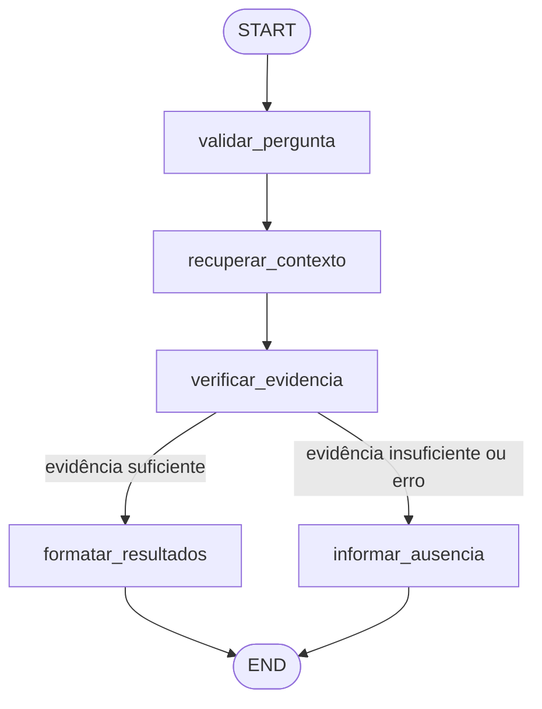

# Protótipo RAG do agente tutor

## Arquitetura resumida

O protótipo mantém duas formas de executar a mesma recuperação, sem banco
vetorial e sem usar um LLM nos passos de controle. O fluxo simples é:

1. descobrir somente os arquivos permitidos;
2. dividir o Markdown em trechos com sobreposição;
3. gerar embeddings com `gemini-embedding-001`;
4. manter os vetores em memória;
5. comparar a pergunta e os trechos por similaridade de cosseno;
6. retornar até três evidências ou admitir ausência de evidência suficiente.

O limite padrão é `0.65`. Ele continua configurável nas chamadas de busca e é
uma calibração inicial baseada na demonstração: as evidências sobre pagamento
ficaram entre `0.701` e `0.741`, enquanto a pergunta sobre férias produziu um
falso positivo de `0.552`. Esse corte reduz aquele falso positivo, mas não é uma
garantia universal e deve ser recalibrado com mais perguntas representativas.

`rag_tutor.py` contém o núcleo reutilizável. `agente_tutor.py` integra esse núcleo
ao CrewAI. `demo_rag.py` oferece uma demonstração direta no terminal e não
executa a auditoria nem altera `DIAGNOSTICO.md`.

## API HTTP para integração

`rag_api.py` expõe somente a recuperação documental necessária para uma futura
tela do tutor:

- `GET /health`: confirma que o processo HTTP está ativo sem indexar documentos;
- `POST /ask`: recebe `{"question":"..."}` e devolve evidências estruturadas;
- cada fonte contém arquivo, posição, similaridade e conteúdo;
- a resposta também informa threshold e totais de documentos e trechos;
- uma pergunta vazia retorna ausência de evidência sem chamar embeddings.

A API usa diretamente `LocalRAG`. O fluxo LangGraph continua disponível como
demonstração separada, mas não é necessário na fronteira HTTP porque não altera
ranking, threshold ou qualidade das evidências.

Para publicação, `Dockerfile.rag` usa Python 3.12 e executa como usuário sem
privilégios. Seu contexto é filtrado por `Dockerfile.rag.dockerignore`: entram
na imagem somente o núcleo RAG, a API e os Markdown permitidos. Código Go,
frontend, ambientes virtuais, `.env` e `.git` ficam fora da imagem. O serviço
não precisa instalar CrewAI ou LangGraph.

Exemplo de resposta com evidência:

```json
{
  "answer": "Fonte: README.md ...",
  "has_evidence": true,
  "sources": [
    {
      "file": "README.md",
      "position": 1,
      "similarity": 0.741,
      "content": "trecho recuperado"
    }
  ],
  "threshold": 0.65,
  "documents_indexed": 3,
  "chunks_indexed": 12
}
```

## Arquitetura com LangGraph

`langgraph_rag.py` adiciona uma segunda forma de execução. LangGraph orquestra
validação, recuperação, decisão e formatação; `LocalRAG` continua sendo o único
responsável por indexar, chamar embeddings Gemini e calcular similaridade.
Nenhum LLM é usado dentro dos nós.



Responsabilidades dos nós:

- `validar_pergunta`: remove espaços e aplica o threshold padrão quando ausente;
- `recuperar_contexto`: chama `LocalRAG.search()` e registra falhas controladas;
- `verificar_evidencia`: confirma se há resultado que atingiu o threshold;
- `formatar_resultados`: preserva fonte, posição, similaridade e conteúdo;
- `informar_ausencia`: retorna a mensagem formal de ausência de evidência.

Cada nó recebe o estado e devolve somente suas atualizações, sem mutá-lo. A
sequência executada é observada fora do estado e exibida pelo demo.

## Arquivos indexados

A allowlist aceita exclusivamente:

- `README.md` na raiz;
- `DIAGNOSTICO.md` na raiz;
- arquivos com extensão `.md` dentro de `docs/` e seus subdiretórios.

`AGENTS.md` e arquivos Markdown em outros diretórios não são indexados.

## Medidas de segurança

- os caminhos são resolvidos antes da leitura e precisam permanecer dentro da
  raiz do projeto;
- escapes por links simbólicos são rejeitados;
- `.git`, `.env` e variantes como `.env.local` são bloqueados;
- arquivos não Markdown e arquivos fora da allowlist são rejeitados;
- `demo_rag.py` lê somente a entrada `GOOGLE_API_KEY` do `.env` quando ela não
  estiver no ambiente; o RAG nunca indexa ou exibe o `.env` nem imprime a chave;
- o índice existe somente em memória e não grava documentos ou vetores;
- a demonstração funciona em modo somente leitura.
- a API aceita corpo de até 4 KiB e perguntas de até 500 caracteres;
- origens web precisam estar explicitamente em `RAG_CORS_ALLOWED_ORIGINS`;
- uma origem rejeitada recebe `403` antes de qualquer chamada de embedding;
- `rag_api.py` usa `GOOGLE_API_KEY` apenas pelo ambiente e nunca lê `.env`;
- a API não importa o CrewAI, não expõe as ferramentas do agente auditor, não
  executa comandos e não permite escolher caminhos de arquivos.
- a imagem de produção executa sem usuário root e contém somente os arquivos
  necessários para a recuperação documental.

## Executar os testes

No Git Bash para Windows:

```bash
cd /c/Users/marce/projetcs/ada/go-backend/modulo-01/desafio-pedidos
source .venv/Scripts/activate
python -m unittest -v test_rag_tutor.py
python -m unittest -v test_langgraph_rag.py
python -m unittest -v test_rag_api.py
```

Se `.venv` não funcionar:

```bash
source venv/Scripts/activate
```

Se o comando `python` não estiver disponível:

```bash
py -3 -m unittest -v test_rag_tutor.py
py -3 -m unittest -v test_langgraph_rag.py
py -3 -m unittest -v test_rag_api.py
```

Os testes usam embeddings falsos e não acessam o Gemini.

## Executar a demonstração

Mantenha `GOOGLE_API_KEY` no `.env` da raiz. O script carrega essa configuração
automaticamente, sem exibir seu valor. Uma variável já definida no ambiente tem
prioridade e não é sobrescrita.

```bash
cd /c/Users/marce/projetcs/ada/go-backend/modulo-01/desafio-pedidos
source .venv/Scripts/activate
python demo_rag.py
python demo_langgraph_rag.py
```

Se `.venv` não funcionar:

```bash
source venv/Scripts/activate
python demo_rag.py
python demo_langgraph_rag.py
```

Se o comando `python` não estiver disponível:

```bash
py -3 demo_rag.py
py -3 demo_langgraph_rag.py
```

O programa mostra quantos documentos e trechos foram indexados. Para cada
resultado, exibe arquivo, posição do trecho, similaridade e conteúdo. Também
mostra o limite mínimo usado. Se todos os resultados ficarem abaixo do limite,
exibe `Nenhuma evidência suficiente` e a mensagem formal de ausência.

O demo LangGraph também mostra a sequência de nós e o estado final relevante.
Para instalar a dependência registrada, se necessário:

```bash
python -m pip install -r requirements.txt
```

## Comparação objetiva

A versão simples chama `LocalRAG` diretamente e tem menos abstrações, sendo a
melhor referência para entender recuperação e similaridade. A versão LangGraph
usa exatamente o mesmo `LocalRAG`, mas torna explícitos os estados, passos e
ramos condicionais, o que facilita observar e evoluir fluxos maiores.

LangGraph não melhora embeddings, ranking ou qualidade documental por si só.
Nesta versão ele acrescenta somente orquestração. O custo externo de ambas as
formas continua restrito aos embeddings Gemini.

## Exemplos de perguntas

Cenário com evidência esperada:

```text
Como funciona o fluxo de pagamento de um pedido?
```

Resultado esperado: até três trechos, com scores observados acima de `0.65`,
preservando o nome de cada arquivo de origem.

Cenário sem evidência esperada:

```text
Qual é a política de férias dos funcionários da empresa?
```

Resultado esperado com a calibração atual: nenhum trecho recuperado.

Quando nenhum trecho atingir o limite mínimo, a saída será:

```text
Não encontrei evidência suficiente na documentação indexada.
```

## Como interpretar o resultado

`Arquivo` identifica a origem da evidência. `Posição` começa em 1 e representa a
ordem do trecho dentro desse arquivo. `Similaridade` é o cosseno entre os dois
vetores: quanto mais próximo de 1, maior a proximidade semântica. O score não é
uma probabilidade nem comprova que a documentação está correta.

## Recuperação documental e confirmação no código

O RAG preserva as fontes recuperadas e não decide silenciosamente qual delas é
correta. `README.md` e `DIAGNOSTICO.md` podem representar momentos diferentes
do projeto e conter afirmações potencialmente conflitantes — por exemplo, uma
fonte pode descrever DLQ como existente enquanto outra ainda recomenda sua
implementação. Nesta etapa não há detecção automática de contradições.

Antes de concluir sobre uma funcionalidade, use os trechos apenas para localizar
o assunto e valide a implementação real nos arquivos de código e configuração.

## Limitações conhecidas

- o índice é recriado a cada execução e faz uma chamada ao Gemini por trecho;
- não há cache, persistência, busca híbrida ou reordenação dos resultados;
- o corte de similaridade é heurístico e pode precisar de calibração;
- ainda podem ocorrer falsos positivos acima de `0.65` e falsos negativos abaixo;
- o chunking considera tamanho textual, não tokens nem estrutura semântica;
- a recuperação encontra evidências, mas não gera uma resposta final;
- LangGraph adiciona estrutura e uma dependência sem alterar a qualidade da busca;
- o grafo usa estado em memória e não possui checkpoint ou persistência;
- documentação pode estar desatualizada, contraditória ou refletir outro momento
  do projeto, por isso não substitui a confirmação no código.
